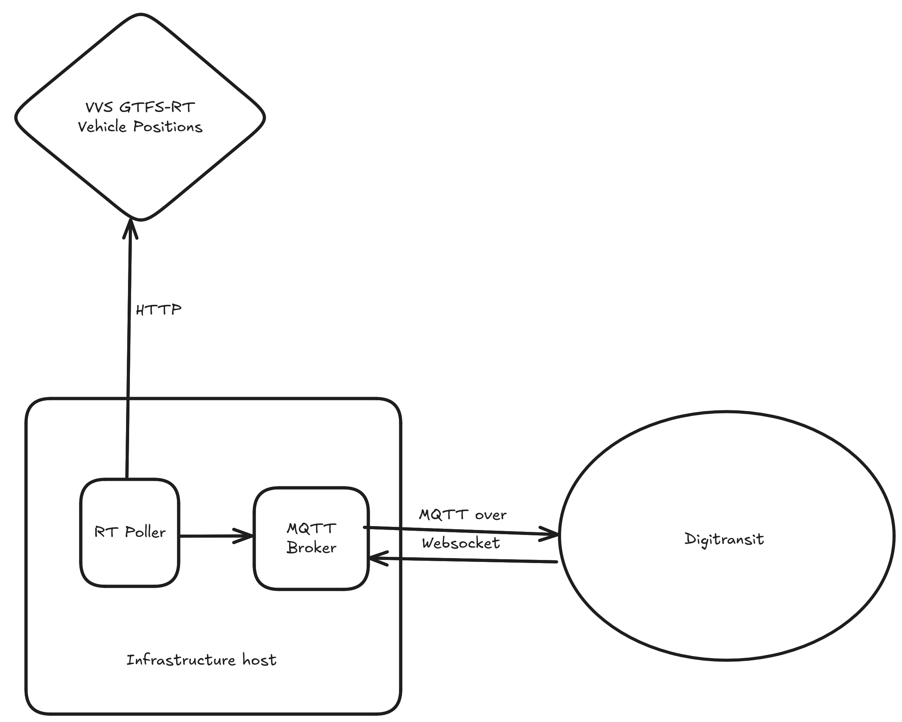

### Vehicle positions

The vehicle positions are sent to Digitransit through a chain of services which are drawn in the following
diagram:



Originally, the data is provided by VVS and picked up by a GTFS-RT-to-MQTT bridge. This then
publishes the data onto a MQTT broker (Mosquitto) which makes them available through a series
of topics.

Digitransit can cannot to the MQTT broker via Websockets and subscribe to the data. Depending
on the exact poll frequency, it may take a few seconds until data really appears in the app.

If you want to look at the raw MQTT topic you can do the following:

```sh
npm install -g mqtt
mqtt subscribe -h vehiclepositions.stadtnavi.eu -p 443 -l wss -v -t "#" -i my-client
```